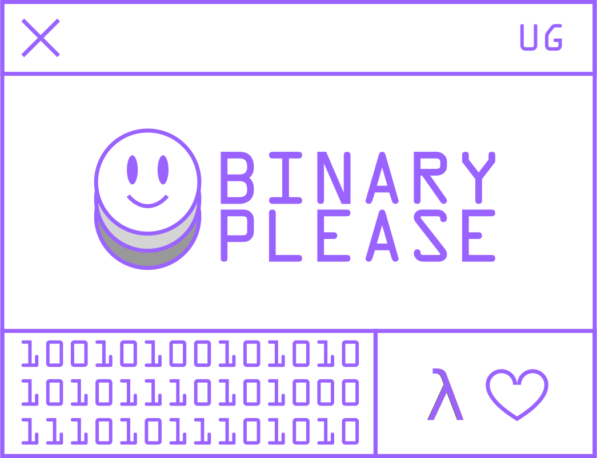

<a href="https://binaryplease.com/"></img></a>

Hi there λ.λ

how can I help you?

## About

Founder and full-stack developer at [**Binary Please**](https://binaryplease.com/).

Our focus is on creating scalable, high-quality web applications, utilizing **purely functional programming**.

## Stack[^1]

&nbsp;
&nbsp;
&nbsp;<picture><source media="(prefers-color-scheme: light)" srcset="images/ps-original.svg"><source media="(prefers-color-scheme: dark)" srcset="images/ps-original-light.svg"></picture>
&nbsp;
&nbsp;
&nbsp;

## Projects

Some of the recent projects I've been working on.

<table>
    <tr>
        <td>Project</td>
        <td>Description</td>
        <td>Stack</td>
        <td>Type</td>
    </tr>
    <tr>
        <td colspan="4"><b>Production</b></td>
    </tr>
     <tr>
        <td>
          
        </td>
        <td>
          Online networking that's fun! 
          HyHyve is an online event and networking platform where you can create an engaging venue for your clients, co-workers, teammates, and community.
        </td>
        <td>
          
          
          
          
        </td>
        <td>💻 App</td>
    </tr>
    <tr></tr>
    <tr>
        <td>
          <a href="https://coffeechat.ai">
          <picture>
            <source media="(prefers-color-scheme: light)" srcset="images/coffee_chat_ai_logo_full_dark.07f5b22.svg">
            <source media="(prefers-color-scheme: dark)" srcset="images/coffee_chat_ai_logo_full_light.30d9e27.svg">
            
          </picture>
          </a>
        </td>
        <td>We build meaningful business relationships across your company by arranging weekly 18-minute 1-on-1 CoffeeChats.</td>
        <td>
          
          
          
        </td>
        <td>💻 App</td>
    </tr>
    <tr></tr>
    <tr>
      <td>Your Project</td>
      <td>Let's see how we can realise your next project! 
        <a href="https://www.linkedin.com/in/enricoscherlies/">
          Drop me a message!
        </a>
      </td>
      <td>tbd</td>
      <td>tbd</td>
    </tr>
    </tr>
       <tr>
        <td colspan="4" ><b>Open Source</b></td>
    </tr>
    <tr>
        <td><a href="https://github.com/escherlies/bumpi">bumpi</a></td>
        <td>A get next semantic version bump cli tool</td>
        <td>
          
        </td>
        <td>🛠️ Tool</td>
    </tr>
    <tr></tr>
    <tr>
        <td><a href="https://github.com/escherlies/elm-generate-readme">elm-generate-readme</a></td>
        <td>Generate a README.md from an Elm file.</td>
        <td>
          
        </td>
        <td>🛠️ Tool</td>
    </tr>
    <tr></tr>
    <tr>
        <td><a href="https://package.elm-lang.org/packages/escherlies/elm-color/latest/">elm-color</a></td>
        <td>An Elm package to work with web colors.</td>
        <td>
          
        </td>
        <td>
📦 Package
</td>
    </tr>
    <tr></tr>
    <tr>
        <td><a href="https://package.elm-lang.org/packages/escherlies/elm-vectors/latest/">elm-vectors</a></td>
        <td>The engine that powers this page.</td>
        <td>
          
        </td>
        <td>📦 Package</td>
    </tr>
    <tr></tr>
    <tr>
        <td><a href="https://package.elm-lang.org/packages/escherlies/elm-ix-dict/latest/">elm-ix-dict</a></td>
        <td>A Dict data structure that derives keys from values.</td>
        <td>
          
        </td>
        <td>📦 Package</td>
    </tr>
    <tr></tr>
    <tr>
        <td><a href="https://github.com/escherlies/elm-ui-window">elm-ui-window</a></td>
        <td>An resizeable, draggable window engine for Elm. Used in <a href="https://binaryplease.com/">Binary Please</a> and <a href="https://www.hyhyve.com">HyHyve</a></td>
        <td>
          
        </td>
        <td>🧪 Experimental</td>
    </tr>
</table>

[hyhyve]: https://www.hyhyve.com/
[chai]: https://coffeechat.ai

[^1]: Elm, Haskell, NixOS, PureScript, TypeScript, JavaScript, NodeJS