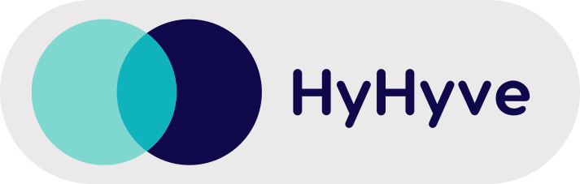

Hi there 👋

how can I help you?

## About

Founder and full-stack developer at [**Binary Please**](https://binaryplease.com/).

We build scalable, maintainable apps with purely functional programming λ.λ

## Projects

\<your logo\>

Let's see how we can realise your next project!

[Drop me a message](https://www.linkedin.com/in/enricoscherlies/)

 

[][hyhyve]

<!-- 

 -->

Online networking that's fun!

HyHyve is an online event and networking platform where you can create an engaging venue for your clients, co-workers, teammates, and community.

[Link][hyhyve]

 

[<picture><source media="(prefers-color-scheme: light)" srcset="images/coffee_chat_ai_logo_full_dark.07f5b22.svg"><source media="(prefers-color-scheme: dark)" srcset="images/coffee_chat_ai_logo_full_light.30d9e27.svg"></picture>](https://coffeechat.ai)

We build meaningful business relationships across your company by arranging weekly 18-minute 1-on-1 CoffeeChats.

<!-- 

 -->

[Link][chai]

## Stack

<table>
    <tr>
        <td></td>
        <td><b>Elm</b></td>
        <td>A great language for the front-end. Lacks some features 🥲</td>
    </tr>
    <tr>
        <td></td>
        <td><b>Haskell</b></td>
        <td>Do you even lift, bro? A very powerful general-purpose language with many features. You could do anything with it. ✨</td>
    </tr>
    <tr>
        <td>
          <picture>
          <source media="(prefers-color-scheme: light)" srcset="images/ps-original.svg">
          <source media="(prefers-color-scheme: dark)" srcset="images/ps-original-light.svg">
          
          </picture></td>
        <td><b>PureScript</b></td>
        <td>Haskell for JavaScript with awesome FFIing. 😎</td>
    </tr>
    <tr>
        <td></td>
        <td><b>NixOS</b></td>
        <td>Get a system up and running with one command. I love it. 😍</td>
    </tr>
    <tr>
        <td></td>
        <td><b>TypeScript</b></td>
        <td>JavaScript with Types. 😏</td>
    </tr>
    <tr>
        <td></td>
        <td><b>JavaScript</b></td>
        <td>Can't to much on the internet without this. 🙄</td>
    </tr>
    <tr>
        <td></td>
        <td><b>NodeJS</b></td>
        <td>Has it's Daseinsberechtigung! 🥳</td>
    </tr>
</table>

## Open Source

| Name                                                                     | Desc                                                 | Stack                                                                                                                 | Kind      |
| ------------------------------------------------------------------------ | ---------------------------------------------------- | --------------------------------------------------------------------------------------------------------------------- | --------- |
| [bumpi](https://github.com/escherlies/bumpi)                             | A get next semantic version bump cli tool            |  | 🛠️ Tool    |
| [elm-generate-readme](https://github.com/escherlies/elm-generate-readme) | Generate a README.md from an Elm file.               |  | 🛠️ Tool    |
| [elm-color](https://github.com/escherlies/elm-color)                     | An Elm package to work with web colors.              |          | 📦 Package |
| [elm-ui-window](https://github.com/escherlies/elm-ui-window)             | The engine that powers this page.                    |          | 📦 Package |
| [elm-ix-dict](https://github.com/escherlies/elm-ix-dict)                 | A Dict data structure that derives keys from values. |          | 📦 Package |

[hyhyve]: https://www.hyhyve.com/
[chai]: https://coffeechat.ai

